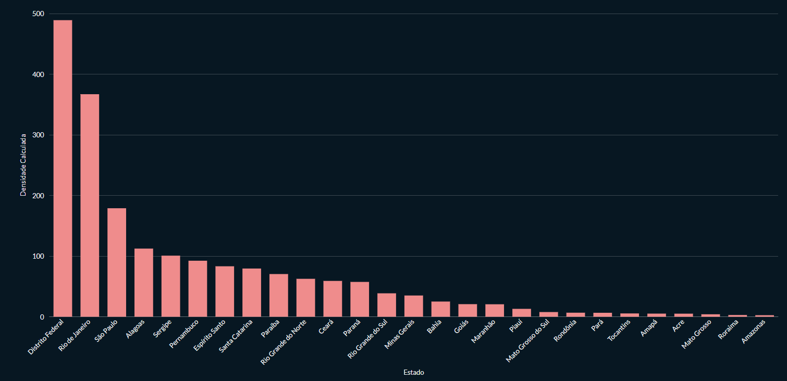
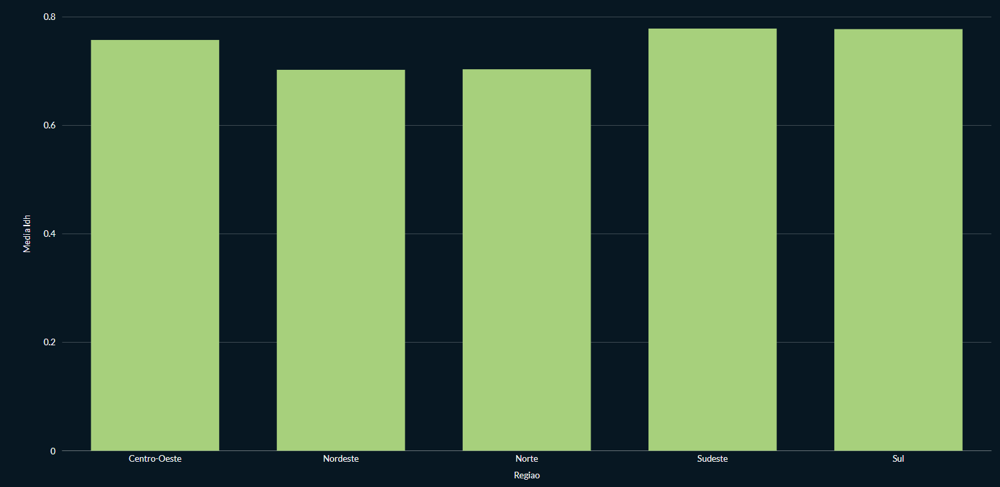
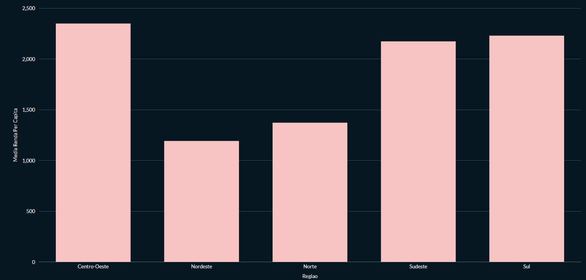
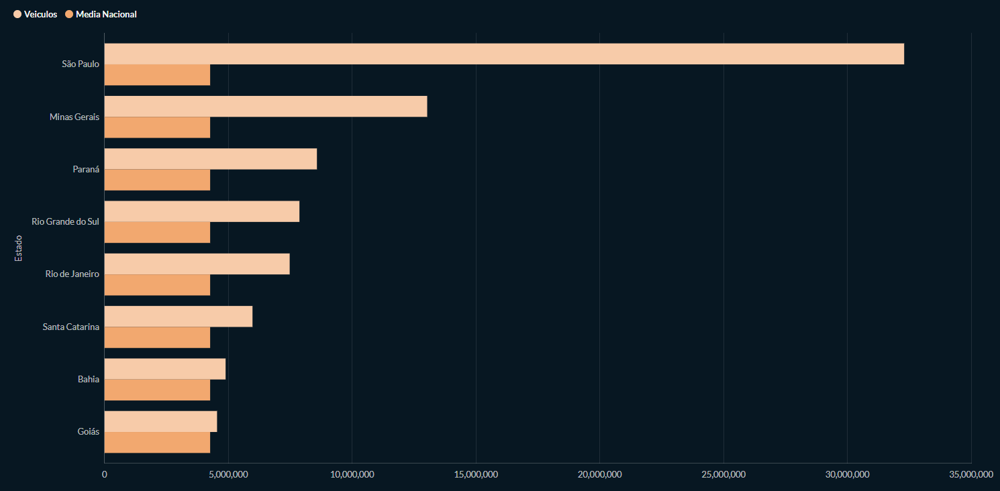
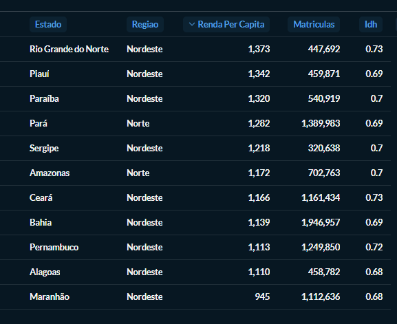

# Instruções de Execução do Projeto Prático: Análise Sociodemográfica e Econômica Nacional via SQL (Dados do Censo)

Dataset disponível em: https://www.kaggle.com/code/ezequielalvessoares/ibge-estat-sticas-brasil-2023

O arquivo original (`IBGE_Estatisicas_Brasil.csv`) foi importado e tratado em R antes de ser carregado no banco. O script realiza a leitura com encoding `latin1`, renomeia as colunas para nomes compatíveis com SQL, converte vírgulas decimais em pontos e tipia cada coluna corretamente, auxiliando na importação do Postgres. O CSV resultante (`dados_ibge_tratados.csv`) é o que o `Dockerfile.postgres` embute na imagem.

```r
data <- read.csv(
  "src/IBGE_Estatisicas_Brasil.csv",
  sep           = ";",
  header        = TRUE,
  check.names   = FALSE,   # evita renomeação automática de colunas
  fileEncoding  = "latin1" # trata caracteres especiais do original
)

names(data) <- c(
  "estado", "uf", "gentilico", "governador", "capital",
  "area_km2", "populacao", "densidade", "matriculas", "idh",
  "receitas", "despesas", "renda_per_capita", "veiculos"
)

# Colunas com vírgula decimal → ponto e conversão para numeric
colunas_decimais <- c("area_km2", "densidade", "idh", "receitas", "despesas")
data[colunas_decimais] <- lapply(
  data[colunas_decimais],
  function(x) as.numeric(gsub(",", ".", x))
)

# Colunas inteiras
colunas_inteiras <- c("populacao", "matriculas", "renda_per_capita", "veiculos")
data[colunas_inteiras] <- lapply(data[colunas_inteiras], as.integer)

write.csv(data, "dados_ibge_tratados.csv", row.names = FALSE)
```

---

## Estrutura do projeto

```
ibge-metabase/
├── Dockerfile.postgres          # Imagem postgres com dados tratados do .csv já embutidos
├── docker-compose.yml           # Stack completa
├── init-db/
│   ├── 01_schema.sql            # Schema, carga do .csv e views do banco de dados
│   └── dados_ibge_tratados.csv  # Dados do IBGE dos 27 estados brasileiros
└── README.md
```

---

## Subindo a stack

```bash
# 1. Na primeira vez (ou após editar o arquivo Dockerfile.postgres)
docker compose up --build -d

# 2. Nas demais vezes
docker compose up -d
```

O Metabase estará disponível em **http://localhost:3000** assim que os
healthchecks dos dois bancos passarem (geralmente ~30 s).

---

## Conectando o banco IBGE no Metabase

Após o primeiro acesso e criação do admin:

1. **Settings → Databases → Add database**
2. Preencha:
   | Campo    | Valor      |
   |----------|------------|
   | Type     | PostgreSQL |
   | Host     | `ibge-db`  |
   | Port     | `5432`     |
   | Database | `ibge`     |
   | User     | `bigdata`  |
   | Password | `12345`    |
3. Clique em **Save** — o Metabase vai sincronizar automaticamente as tabelas e views.

> As **views** (`v_densidade_demografica`, `v_agregacao_macrorregional`, etc.)
> aparecerão listadas e já podem ser usadas diretamente para criar perguntas
> e cards no dashboard, podendo também serem criadas sem escrever SQL manual.

---

## Desenvolvimento dos Desafios Técnicos (Queries SQL)

### Desafio 1 — Cálculo de Densidade Demográfica

```sql
SELECT
    estado,
    populacao,
    area_km2,
    ROUND(populacao::NUMERIC / area_km2, 5) AS densidade_demografica_calculada
FROM ibge_estados
ORDER BY densidade_demografica_calculada DESC;
```
Gráfico da densidade demográfica calculada para cada estado brasileiro:



### Desafio 2 — Agregação Macrorregional

```sql
SELECT
    regiao,
    COUNT(*)                                  AS qtd_estados,
    ROUND(AVG(idh)::NUMERIC, 3)              AS media_idh,
    ROUND(AVG(renda_per_capita)::NUMERIC, 2) AS media_renda_per_capita
FROM ibge_estados
GROUP BY regiao
ORDER BY regiao;
```
Gráfico da média de IDH por região do Brasil.


Gráfico da média de renda per capita por região do Brasil.


### Desafio 3 — Filtragem por Linha de Corte Dinâmica

```sql
SELECT
    estado,
    regiao,
    veiculos,
    ROUND((SELECT AVG(veiculos) FROM ibge_estados)::NUMERIC, 2) AS media_nacional
FROM ibge_estados
WHERE veiculos > (
    SELECT AVG(veiculos)
    FROM ibge_estados
)
ORDER BY veiculos DESC;
```
Gráfico dos estados com quantidade de veículos acima da média nacional.


### Desafio 4 — Análise de Vulnerabilidade Social

```sql
SELECT
    estado,
    regiao,
    renda_per_capita,
    matriculas,
    idh
FROM ibge_estados
WHERE renda_per_capita < 1500
  AND matriculas > 200000
ORDER BY renda_per_capita ASC;
```
Tabela dos estados identificados na análise de vulnerabilidade social.


---

## Views prontas no banco

| View                       | Finalidade                                  |
|----------------------------|---------------------------------------------|
| `v_densidade_demografica`  | Desafio 1 — densidade calculada, decrescente|
| `v_agregacao_macrorregional` | Desafio 2 — médias de IDH e renda por região|
| `v_frota_acima_da_media`   | Desafio 3 — estados acima da média nacional |
| `v_vulnerabilidade_social` | Desafio 4 — renda < 1500 e matrículas > 200k|
| `v_resumo_por_regiao`      | Extra — população, veículos, IDH por região |
